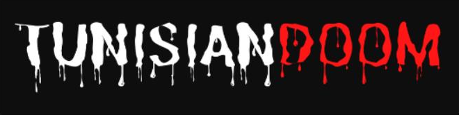

 
  

<h2 id="about-me">:bulb: About Me</h2>

I am a software developer and an avid gamer, blending my passion for technology with my love for immersive virtual experiences. With a solid foundation in coding and a knack for problem-solving, I approach software development with enthusiasm and dedication.
This is a game that i made which was inspired from The game called Metal Slug, this game is a 2D platformer pixel art game where you explore  the map filled with enemies so you could go to the next level. 

<h2 id="overview"> :cloud: Overview</h2>

 
  In this project you will play as the hero to get pass the first level , i wanted to imply the action  genre because it will make the game more fun to play.For game creation, I decided to use the Godot engine which is an engine created in 2014
and what pushed me toward Godot its simplicity and you need to remember that I have no knowledge whatsoever in making a game, so I tried to find a simple and easy to understand engine
And for the creation of the asset, i used Aseprite editor.
</p2>

<h2 id="The-story-behind-our-project"> :joystick: The story behind our project</h2>

 
I enjoyed playing video games as a kid, so it was my first instinct to try and learn how to make one. the first game I felled in love with when I was a kid called "Metal Slug" which was released in mid 90s.
On the other hand, I had an idea to make a game that let the world know more about my country "Tunisia". So, it was the perfect opportunity to implement my idea.
</p2>

<h2 id="implemented-features"> :magic_wand:  Implemented features</h2>

 
-Collecting and counting rewards.
-Player and enemy damage
-Enemy IA 
-Switching between levels
-Adding sound effects
</p2>
<h2 id="features-that-still-need-to-be-implementeds"> :cloud:  Features that still need to be implemented</h2>

 
-Enemy IA 
-Different combat style for the player
-More dynamic gameplay
</p2>

<h2 id="difficult-challenges-encountered"> :dart:  Difficult challenges encountered</h2>

 
1- The design of enemies, the selection of their attacks, behaviors, and AI patterns/responses is a complex task which is easily underestimated.Designed enemies are an important part of a melee combat system. Enemies are the challenge for players to overcome using the combat system, Enemies have at least one attack and often a way to defend themselves, although this varies between games. In some games enemies have only one attack while in other games enemies have multiple attacks with differing variables such as damage dealt; duration of the anticipation, hit frames, and cooldown, The enemy AI controls how all enemies move around, attack, and respond to certain events (such as the player attacking). Besides the individual enemy AI. 
2- Memory Leak and Multiple instances of the same texture also Unnecessary Iterations like Calling a for/while loop once is easier on the resources than calling it multiple times.
</p2>

<h2 id="project-files-description"> :floppy_disk: Project Files Description</h2>
  <ul>
  <li><b>Scripts</b> - Where all game scripts reside.</li>
  <li><b>Scenes</b> - Where all game scenes reside.</li>
</ul>

<h2 id="getting-started"> :book: Getting Started</h2>

You are able to start the game downlading godot and scaning the game file

<h2 id="credits"> :scroll: Credits</h2>

Mohamed Ahmed Zghal 

